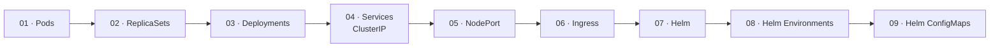

# Kubernetes From Zero

Hands-on Kubernetes course covering the core building blocks through practical manifests, `kubectl` exercises, and Helm charts.

## Course Structure

## Classes

| # | Topic | Objective |
|---|---|---|
| [01](classes/01-pods/) | **Pods** | Create and run a single Pod; inspect lifecycle and cluster-internal networking |
| [02](classes/02-replicasets/) | **ReplicaSets** | Maintain a desired number of Pod replicas; observe self-healing |
| [03](classes/03-deployments/) | **Deployments** | Manage ReplicaSets; perform rolling updates and rollbacks |
| [04](classes/04-services/) | **Services (ClusterIP)** | Expose Pods internally via a stable DNS name; test with port-forward and a curl Pod |
| [05](classes/05-nodeport/) | **NodePort** | Expose a Service outside the cluster on a fixed node port |
| [06](classes/06-ingress/) | **Ingress** | Route external HTTP traffic to multiple backends using path-based rules |
| [07](classes/07-helm/) | **Helm** | Package the Ingress application as a chart and parameterise it progressively |
| [08](classes/08-helm-envs/) | **Helm Environments** | Deploy the same chart with separate development and production values |
| [09](classes/09-helm-configmap/) | **Helm ConfigMaps** | Store non-sensitive configuration and consume it as environment variables or mounted files |

## Images Used

| Image | Used in |
|---|---|
| `traefik/whoami` | 01 · Pods, 06 · Ingress, 07–09 · Helm |
| `ealen/echo-server` | 02 · ReplicaSets, 03 · Deployments, 04 · Services, 05 · NodePort, 06 · Ingress, 07–09 · Helm |
| `curlimages/curl` | 04 · Services (temporary test Pod) |

## Prerequisites

- A running Kubernetes cluster (Docker Desktop, minikube, or kind)
- `kubectl` configured and pointing to the cluster
- For class 06: an NGINX Ingress Controller installed in the cluster
- For classes 07–09: Helm installed and available as `helm`

## Notes

> Write here anything you discovered while experimenting.
