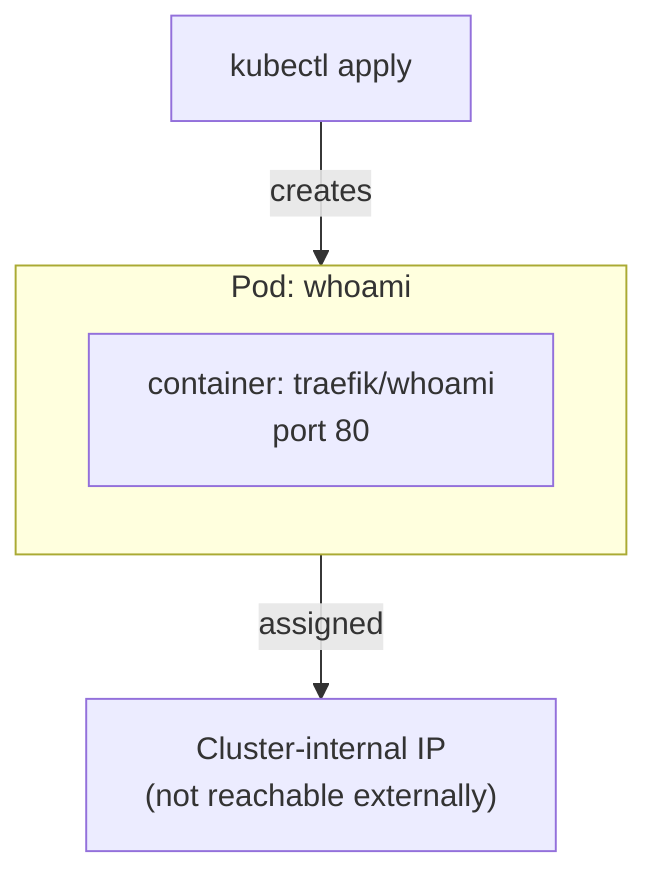

# 01 — Pods

## Objective

Create and run a single Pod manually, then inspect and interact with it using `kubectl`.

## Theory

A **Pod** is the smallest deployable unit in Kubernetes. It wraps one or more containers that share the same network namespace and storage volumes. In practice, most Pods run a single container.

Key concepts covered in this class:

- What a Pod is and how it differs from a plain Docker container
- Pod lifecycle: `Pending` → `Running` → `Succeeded` / `Failed`
- How Kubernetes assigns an IP address to a Pod (cluster-internal only)
- The role of `containerPort` (informational, does not publish the port externally)
- Why Pods are **ephemeral** — they are not self-healing on their own

## Architecture



## Resources Used

| Image | Purpose |
|---|---|
| `traefik/whoami` | Lightweight HTTP server that responds with host/request info |

## Files

| File | Description |
|---|---|
| `pod.yaml` | Defines a single Pod named `whoami` running `traefik/whoami` on port 80 |

## Commands

```bash
# Apply the manifest and create the Pod
kubectl apply -f pod.yaml

# List all Pods and watch their status
kubectl get pods
kubectl get pods -w

# Print full details about the Pod (events, IP, node, container status)
kubectl describe pod whoami

# Stream logs from the container
kubectl logs whoami -f

# Open an interactive shell inside the container
kubectl exec -it whoami -- sh

# Delete the Pod
kubectl delete -f pod.yaml
# or by name
kubectl delete pod whoami
```

## Verification

After applying, confirm the Pod reaches `Running` status:

```bash
kubectl get pods
# NAME     READY   STATUS    RESTARTS   AGE
# whoami   1/1     Running   0          10s
```

Test connectivity from inside the cluster (e.g. from another Pod or `kubectl exec`):

```bash
# Get the Pod IP
kubectl get pod whoami -o wide

# curl from inside the cluster
curl http://<POD_IP>:80
```

## Key Takeaways

- A Pod is a thin wrapper around one or more containers with a shared IP.
- `containerPort` is metadata only — it does **not** expose the port to the outside world.
- Pods are ephemeral. If deleted, they are gone — nothing recreates them automatically.
- Use `kubectl describe` and `kubectl logs` as your first debugging tools.
- To expose a Pod externally you need a **Service** (covered in class 04).

## Notes

> Write here anything you discovered while experimenting.
