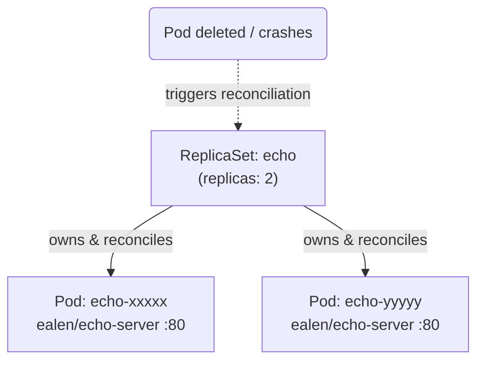

# 02 — ReplicaSets

## Objective

Understand how a ReplicaSet keeps a stable set of replica Pods running at all times, and observe its self-healing behaviour.

## Theory

A **ReplicaSet** is a controller that ensures a specified number of identical Pod replicas are running at any given moment.

Key concepts covered in this class:

- How a ReplicaSet uses a **label selector** (`matchLabels`) to find and own Pods
- The reconciliation loop: Kubernetes continuously compares *desired* vs *actual* state
- Self-healing: if a Pod is deleted or crashes, the ReplicaSet automatically recreates it
- Why you should **not** manage ReplicaSets directly in production (use Deployments instead — class 03)
- The relationship between `selector.matchLabels` and `template.metadata.labels` — they must match

## Architecture



## Resources Used

| Image | Purpose |
|---|---|
| `ealen/echo-server` | Lightweight echo server that reflects request headers and body |

## Files

| File | Description |
|---|---|
| `replicaset.yaml` | Defines a ReplicaSet named `echo` with **2 replicas** of `ealen/echo-server` on port 80 |

## Commands

```bash
# Create the ReplicaSet
kubectl apply -f replicaset.yaml

# List the ReplicaSet and its Pods
kubectl get rs
kubectl get pods

# Inspect the ReplicaSet in detail (notice Events section)
kubectl describe rs echo

# Scale the ReplicaSet up/down imperatively
kubectl scale rs echo --replicas=4
kubectl scale rs echo --replicas=1

# Force self-healing: delete one Pod and watch the ReplicaSet recreate it
kubectl delete pod <pod-name>
kubectl get pods -w

# Remove everything
kubectl delete -f replicaset.yaml
```

## Verification

After applying, all Pods should be `Running`:

```bash
kubectl get rs
# NAME   DESIRED   CURRENT   READY   AGE
# echo   2         2         2       15s

kubectl get pods
# NAME         READY   STATUS    RESTARTS   AGE
# echo-xxxxx   1/1     Running   0          15s
# echo-yyyyy   1/1     Running   0          15s
```

To verify self-healing, delete one Pod and confirm it is replaced:

```bash
kubectl delete pod <one-of-the-echo-pods>
kubectl get pods -w
# A new Pod should appear within seconds
```

## Key Takeaways

- A ReplicaSet guarantees **N copies** of a Pod are always running.
- The `selector.matchLabels` field is how the controller identifies which Pods it owns — keep it in sync with `template.metadata.labels`.
- Manually deleting a managed Pod proves the self-healing loop: the ReplicaSet brings it back immediately.
- ReplicaSets have **no built-in rollout strategy** — that's what Deployments add on top.

## Notes

> Write here anything you discovered while experimenting.
