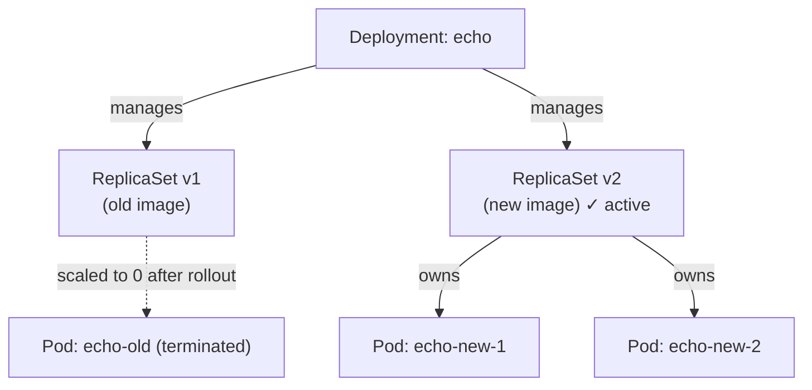

# 03 — Deployments

## Objective

Use a Deployment to manage ReplicaSets, perform declarative updates, and execute rolling rollouts with zero downtime.

## Theory

A **Deployment** is a higher-level controller that wraps a ReplicaSet and adds versioned rollout management on top of it.

Key concepts covered in this class:

- How a Deployment owns and manages ReplicaSets under the hood
- **Declarative updates**: changing the image tag triggers an automatic rolling update
- **Rolling update strategy**: Kubernetes gradually replaces old Pods with new ones, keeping the service available throughout
- **Rollback**: Deployment history lets you revert to a previous revision instantly
- The `kubectl rollout` sub-commands for monitoring and managing rollouts
- Why Deployments are the standard way to run stateless workloads in Kubernetes

## Architecture



## Resources Used

| Image | Purpose |
|---|---|
| `ealen/echo-server` | Lightweight echo server used as the workload under management |

## Files

| File | Description |
|---|---|
| `deployment.yaml` | Defines a Deployment named `echo` with **2 replicas** of `ealen/echo-server` on port 80 |

## Commands

```bash
# Create the Deployment (also creates a ReplicaSet and 2 Pods)
kubectl apply -f deployment.yaml

# Watch the rollout progress
kubectl rollout status deployment/echo

# List all resources created
kubectl get deployments
kubectl get rs
kubectl get pods

# Inspect the Deployment in detail
kubectl describe deployment echo

# Trigger a rolling update by changing the image
kubectl set image deployment/echo echo=ealen/echo-server:latest

# View rollout history
kubectl rollout history deployment/echo

# Rollback to the previous revision
kubectl rollout undo deployment/echo

# Scale the Deployment
kubectl scale deployment echo --replicas=4

# Remove everything
kubectl delete -f deployment.yaml
```

## Verification

After applying, the Deployment should show all replicas ready:

```bash
kubectl get deployments
# NAME   READY   UP-TO-DATE   AVAILABLE   AGE
# echo   2/2     2            2           20s

kubectl get rs
# NAME             DESIRED   CURRENT   READY   AGE
# echo-<hash>      2         2         2       20s
```

Trigger a rolling update and watch it happen in real time:

```bash
kubectl set image deployment/echo echo=traefik/whoami
kubectl rollout status deployment/echo
kubectl get pods -w
# Old Pods are terminated one-by-one as new ones become Ready
```

## Key Takeaways

- A Deployment manages ReplicaSets — **never edit the ReplicaSet directly** when using a Deployment.
- Rolling updates replace Pods gradually, ensuring zero downtime during image updates.
- Every change creates a new ReplicaSet revision, enabling instant rollbacks with `kubectl rollout undo`.
- Changing `spec.template` (e.g. image, env vars) triggers a new rollout; changing `spec.replicas` does not.

## Notes

> Write here anything you discovered while experimenting.
