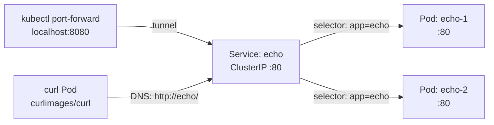

# 04 — Services (ClusterIP)

## Objective

Expose a Deployment's Pods internally within the cluster using a **ClusterIP** Service, and understand how Kubernetes routes traffic to them.

## Theory

A **Service** is a stable network endpoint that provides a consistent IP and DNS name to reach a dynamic set of Pods. Without a Service, you would need to track individual Pod IPs — which change every time a Pod restarts.

Key concepts covered in this class:

- **ClusterIP** (the default Service type): provides an internal-only virtual IP reachable anywhere inside the cluster
- How a Service uses `selector` to find target Pods (same label-matching mechanism as ReplicaSets)
- The relationship between `port` (Service port) and `targetPort` (container port)
- Kubernetes DNS: Services are automatically discoverable via `<service-name>.<namespace>.svc.cluster.local`
- Why a ClusterIP Service is **not** reachable from outside the cluster
- `kubectl port-forward`: a developer shortcut to tunnel a local port to a Service without exposing it permanently
- Running a temporary curl Pod inside the cluster to test Service DNS resolution

## Architecture



## Resources Used

| Image | Purpose |
|---|---|
| `ealen/echo-server` | Echo server that reflects request details, useful to confirm which Pod is responding |

## Files

| File | Description |
|---|---|
| `deployment.yaml` | Deployment named `echo` with 2 replicas of `ealen/echo-server` on port 80, labelled `app: echo` |
| `service.yaml` | ClusterIP Service named `echo` selecting Pods with `app: echo`, forwarding port 80 → 80 |

## Commands

```bash
# Deploy both resources
kubectl apply -f .

# List all created resources
kubectl get pods
kubectl get deployment echo
kubectl get svc echo

# Inspect the Service (note Endpoints — one per Pod)
kubectl describe svc echo

# Forward local port 8080 to the Service port 80
kubectl port-forward svc/echo 8080:80

# In a separate terminal, test it from your machine
curl http://localhost:8080/

# Alternatively, spin up a temporary curl Pod inside the cluster
kubectl run curl --image=curlimages/curl --restart=Never --rm -it -- \
  curl http://echo/

# Remove everything
kubectl delete -f .
```

## Verification

After applying, the Service should have two endpoints (one per replica):

```bash
kubectl get svc echo
# NAME   TYPE        CLUSTER-IP      EXTERNAL-IP   PORT(S)   AGE
# echo   ClusterIP   10.96.x.x       <none>        80/TCP    15s

kubectl describe svc echo
# ...
# Endpoints: 10.244.x.x:80, 10.244.y.y:80
```

**Option A — port-forward from your machine:**

```bash
kubectl port-forward svc/echo 8080:80
# Forwarding from 127.0.0.1:8080 -> 80

# In a separate terminal
curl http://localhost:8080/
# Returns the echo response from one of the backend Pods
```

**Option B — temporary curl Pod inside the cluster:**

```bash
kubectl run curl --image=curlimages/curl --restart=Never --rm -it -- \
  curl http://echo/
# Resolves the Service by DNS name and returns the echo response
# Pod is automatically deleted after the command exits (--rm)
```

## Key Takeaways

- A ClusterIP Service gives your Pods a **stable, cluster-internal IP and DNS name** regardless of Pod churn.
- The `selector` must match the Pod labels — if it doesn't, `Endpoints` will be empty and requests will fail.
- `port` is what clients connect to; `targetPort` is where the container actually listens.
- `kubectl port-forward svc/<name> <local>:<service-port>` tunnels a Service to your laptop — great for debugging without changing the cluster.
- Port-forward is a **temporary, single-user tunnel** — it stops when you `Ctrl+C`. It is not a substitute for NodePort or Ingress.
- ClusterIP Services are **only reachable from within the cluster** — use NodePort or Ingress for permanent external access.

## Notes

> Write here anything you discovered while experimenting.
