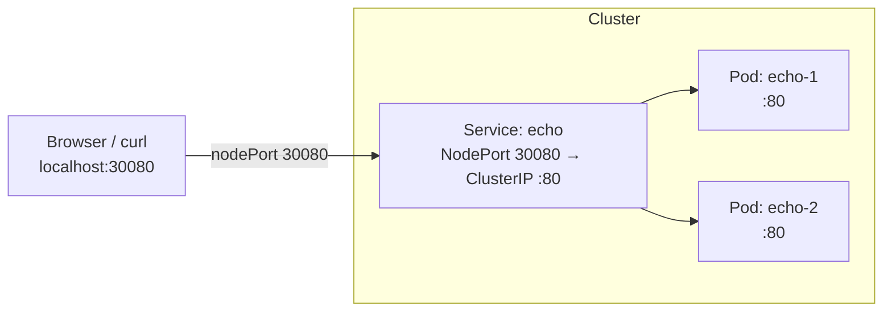

# 05 — NodePort

## Objective

Expose a Service **outside the cluster** using the `NodePort` type, and access the application directly from your local machine via a node's IP and a fixed port.

## Theory

A **NodePort** Service extends ClusterIP by opening a static port on **every node** in the cluster. Traffic hitting `<NodeIP>:<nodePort>` is forwarded to the backing Pods through the Service.

Key concepts covered in this class:

- How NodePort builds on top of ClusterIP (both are created at the same time)
- The three port fields:
  - `nodePort` — port opened on every cluster node (30000–32767), here **30080**
  - `port` — the ClusterIP port clients inside the cluster use
  - `targetPort` — the container port the traffic is ultimately forwarded to
- Why NodePort is useful for development/testing but generally not used in production
- How to reach a NodePort service from `localhost` when using tools like Docker Desktop, minikube, or kind

## Architecture



## Resources Used

| Image | Purpose |
|---|---|
| `ealen/echo-server` | Echo server used to confirm which Pod handled the request |

## Files

| File | Description |
|---|---|
| `deployment.yaml` | Deployment named `echo` with 2 replicas of `ealen/echo-server` on port 80 |
| `service-nodeport.yaml` | NodePort Service named `echo` mapping `30080 → 80 → 80` |

## Commands

```bash
# Deploy both resources
kubectl apply -f .

# Confirm the NodePort assignment
kubectl get svc echo

# Inspect all three port fields
kubectl describe svc echo

# Access the service from outside the cluster
curl http://localhost:30080          # Docker Desktop / kind with port mapping
# or
curl http://<node-ip>:30080         # Bare-metal / VM clusters

# Remove everything
kubectl delete -f .
```

## Verification

After applying, the Service should show the NodePort:

```bash
kubectl get svc echo
# NAME   TYPE       CLUSTER-IP     EXTERNAL-IP   PORT(S)        AGE
# echo   NodePort   10.96.x.x      <none>        80:30080/TCP   10s
```

Access the app from your browser or terminal:

```bash
curl http://localhost:30080
# {"host":{"hostname":"localhost","ip":"::ffff:...","ips":[]},...}
```

Each request may be served by a different Pod — the Service load-balances across all matching replicas.

## Key Takeaways

- NodePort opens port **30080** on every node and forwards traffic to the `echo` Service.
- A NodePort Service also creates a ClusterIP automatically — both access modes work simultaneously.
- The `nodePort` range is `30000–32767` by default; values outside this range require cluster configuration changes.
- NodePort is convenient for local development, but **Ingress** (class 06) is preferred for HTTP workloads in production.

## Notes

> Write here anything you discovered while experimenting.
