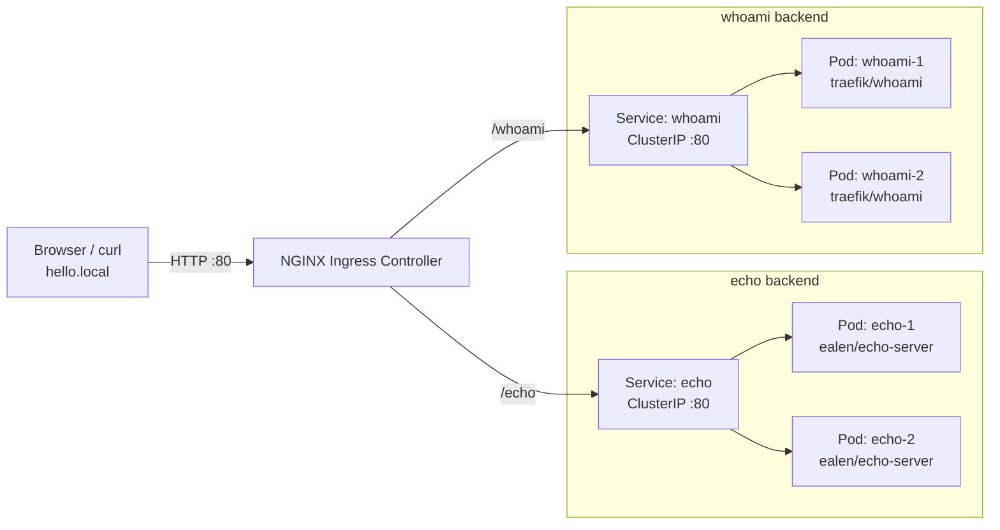

# 06 — Ingress

## Objective

Route external HTTP traffic to **two different backends** using a single Ingress resource with path-based routing: `/echo` → `ealen/echo-server` and `/whoami` → `traefik/whoami`.

## Theory

An **Ingress** is a Kubernetes API object that manages external HTTP/HTTPS access to Services inside the cluster. It provides a richer routing layer than NodePort — supporting host names, URL paths, TLS termination, and more — without requiring a separate load balancer per Service.

Key concepts covered in this class:

- The **Ingress Controller** (here: NGINX): a cluster-wide component that watches Ingress objects and configures the reverse proxy accordingly
- `ingressClassName`: tells Kubernetes which controller should handle this Ingress resource
- **Path-based routing**: a single Ingress rule dispatches traffic to different Services based on the URL path
- `nginx.ingress.kubernetes.io/rewrite-target: /` — strips the path prefix before forwarding to the backend, so `/echo/foo` reaches the container as `/foo`
- How Ingress, Service, and Deployment form a complete request chain:  
  `Client → Ingress Controller → Service (ClusterIP) → Pod`
- Organising multiple backends into sub-folders to keep manifests tidy

## Resources Used

| Image | Purpose |
|---|---|
| `ealen/echo-server` | Echo server that reflects request info, used to verify `/echo` routing |
| `traefik/whoami` | Lightweight HTTP server that responds with host/request info, used to verify `/whoami` routing |

## Architecture



## File Structure

```
06-ingress/
├── echo/
│   ├── deployment.yaml   # Deployment: echo (2 replicas, ealen/echo-server)
│   └── service.yaml      # ClusterIP Service: echo → port 80
├── whoami/
│   ├── deployment.yaml   # Deployment: whoami (2 replicas, traefik/whoami)
│   └── service.yaml      # ClusterIP Service: whoami → port 80
└── ingress.yaml          # Ingress: hello.local/echo → echo, hello.local/whoami → whoami
```

## Prerequisites

An **NGINX Ingress Controller** must be installed in the cluster. For local environments:

```bash
# Docker Desktop / kind
kubectl apply -f https://raw.githubusercontent.com/kubernetes/ingress-nginx/main/deploy/static/provider/kind/deploy.yaml
```

## Commands

```bash
# Deploy each backend
kubectl apply -f echo/
kubectl apply -f whoami/

# Deploy the Ingress
kubectl apply -f ingress.yaml

# Check all resources
kubectl get deployments
kubectl get svc
kubectl get ingress apps

# Inspect routing rules
kubectl describe ingress apps

# Add a local DNS entry
echo "127.0.0.1 hello.local" | sudo tee -a /etc/hosts

# Test each path
curl http://hello.local/echo
curl http://hello.local/whoami

# Remove everything
kubectl delete -f ingress.yaml
kubectl delete -f echo/
kubectl delete -f whoami/
```

## Verification

After applying, the Ingress should list both paths:

```bash
kubectl get ingress apps
# NAME   CLASS   HOSTS         ADDRESS     PORTS   AGE
# apps   nginx   hello.local   localhost   80      20s

kubectl describe ingress apps
# Rules:
#   hello.local
#     /echo    echo:80
#     /whoami  whoami:80
```

Test each route (using the `Host` header avoids editing `/etc/hosts`):

```bash
curl -H "Host: hello.local" http://localhost/echo
# Returns the echo-server JSON response

curl -H "Host: hello.local" http://localhost/whoami
# Returns whoami host/IP info
```

## Key Takeaways

- A single Ingress can route to **multiple Services** using different path rules — no extra IPs or ports needed.
- `rewrite-target: /` is required here so backends receive `/` instead of `/echo` or `/whoami`, which they don't understand.
- `ingressClassName: nginx` binds this Ingress to the NGINX controller specifically.
- The backend Service must exist and its selector must match the Pods, or the Ingress will return `503`.
- Splitting backends into sub-folders (`echo/`, `whoami/`) keeps manifests organised and lets you apply or delete each app independently.

## Notes

> Write here anything you discovered while experimenting.
